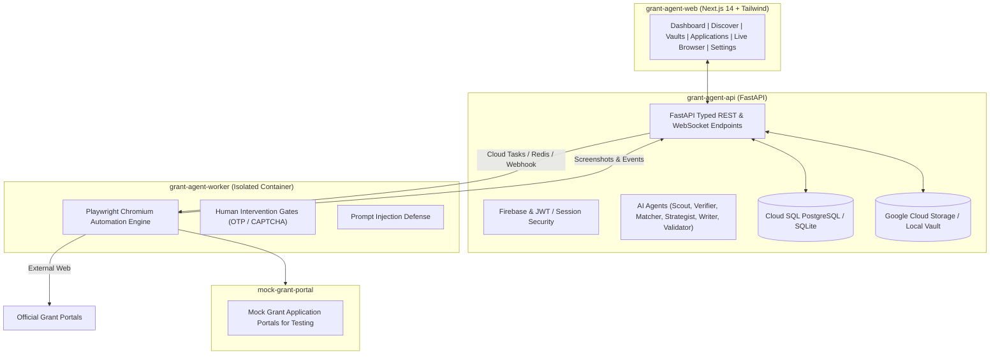

# Grant Agent - Architecture & Implementation Plan

## 1. System Overview
**Grant Agent** is an enterprise-grade, cloud-native grant discovery, research, strategy, and browser automation platform designed for deployment on Google Cloud (Cloud Run, Cloud SQL, Cloud Storage, Secret Manager, Cloud Tasks, Cloud Scheduler, and Gemini / Vertex AI).

It implements the strict end-to-end workflow:
**DISCOVER → ANALYSE → MATCH → STRATEGISE → PREPARE → APPLY → REVIEW → SUBMIT → TRACK**

### Core Invariants & Safety Mandates:
1. **Never fabricate applicant facts**: Never claim partnerships, revenue, users, beneficiaries, or funding unless they exist in the applicant profile with `VERIFIED` status or approved evidence.
2. **Approved Documents Only**: External portals receive documents only if explicitly marked `APPROVED FOR APPLICATION USE`.
3. **Never bypass security controls**: Never bypass CAPTCHA, OTP, identity verification, or electronic signatures. The browser agent halts and initiates a human intervention gate.
4. **Prompt Injection Protection**: Webpage content is treated as untrusted data and strictly prevented from overriding system instructions or leaking secrets.
5. **Human Approval Gate**: Submissions require explicit human review and approval.

---

## 2. Service Architecture

---

## 3. Implementation Phases & Milestones

### Phase 1: Core Foundation, Data Models & Profile/Document Vaults
- Complete database schema & SQLAlchemy models:
  `User`, `Organisation`, `Founder`, `TeamMember`, `OrganisationMetric`, `OrganisationProject`, `Document`, `Grant`, `GrantSource`, `GrantRequirement`, `GrantQuestion`, `GrantMatch`, `GrantStrategy`, `Application`, `ApplicationQuestion`, `ApplicationAnswer`, `ApplicationDocument`, `BrowserSession`, `BrowserEvent`, `ApplicationSubmission`, `Notification`, `AutomationRule`, `AuditLog`.
- Organisation Profile Vault with granular verification levels (`VERIFIED`, `UNVERIFIED`, `DO NOT USE`) across all 13 sections.
- Document Vault with category tracking, text/metadata extraction, and `APPROVED FOR APPLICATION USE` flags.
- Seed data for realistic organisations (e.g. *Lioris*, *Princess Sara Foundation*) with verified profiles.

### Phase 2: Grant Scout, Stage Classification, Verification & Matching
- Grant Scout Agent supporting web search, RSS, curated directories, user URL pasting ("PASTE GRANT URL"), and Exact-URL mode.
- Grant Stage Classification Engine:
  - **GREEN**: Idea Stage (No MVP needed)
  - **YELLOW**: Validation Stage (PoC / research / pilot plan)
  - **ORANGE**: MVP Required
  - **RED**: Traction Required (Revenue / users / active pilots)
- Grant Verification Agent checking official authoritativeness; unconfirmed fields marked `UNCONFIRMED`.
- Grant Matching Agent evaluating eligibility against verified profiles:
  `ELIGIBLE`, `LIKELY ELIGIBLE`, `ELIGIBILITY UNCLEAR`, `NOT ELIGIBLE`, with strong/weak factors, missing requirements, and internal relevance score.

### Phase 3: Application Strategist, Application Writer & Consistency Checker
- Application Strategist Agent synthesizing grant priorities and verified organisation evidence into tailored project positioning.
- Application Writer Agent drafting precise answers respecting exact word/character limits, utilizing simple human language without AI fluff, and citing source information.
- Application Consistency Checker (Validation Agent) identifying cross-question contradictions, budget discrepancies, missing evidence, or claim exaggerations.

### Phase 4: Playwright Browser Worker & Human-in-the-Loop Gates
- Isolated Playwright container worker.
- Form detector supporting all field types (text, textarea, email, phone, number, date, dropdown, radio, checkbox, file upload, multi-select).
- Dynamic answer and approved document filler.
- Human intervention triggers (OTP, email verification, CAPTCHA, identity verification, legal declarations).
- Prompt-injection defense engine against untrusted website DOM.
- Live browser view & interactive takeover protocol.
- Comprehensive Mock Grant Application Portal testing suite.

### Phase 5: Production Web Dashboard, Google Cloud Deployment & Verification
- Next.js responsive web UI with all 9 navigation tabs, grant cards with stage badges, filters, application review screen, document manager, live browser view, and audit logs.
- Cloud deployment assets: Dockerfiles, `docker-compose.yml`, GCP Cloud Run, Cloud SQL, Secret Manager, Cloud Storage, Cloud Tasks, and Cloud Scheduler configurations.
- Automated test suite (unit tests, API tests, browser automation tests, consistency tests).
